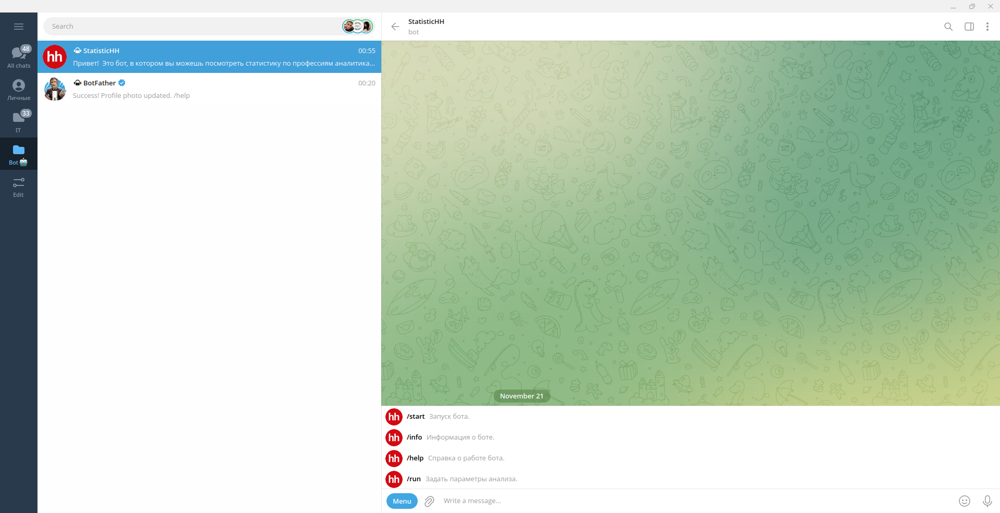
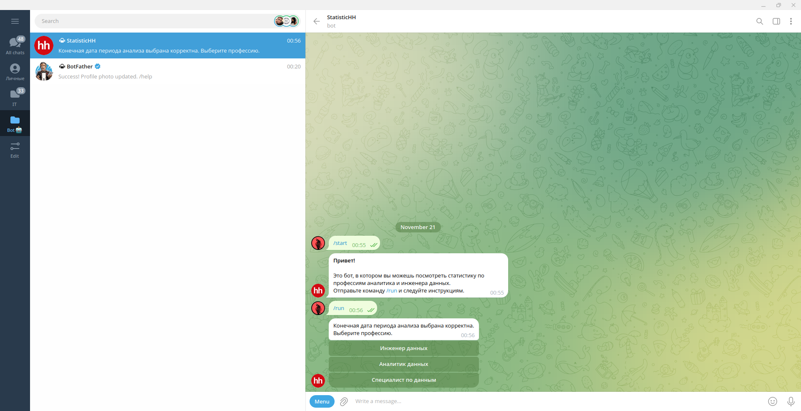
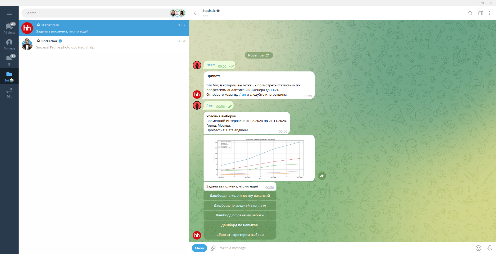

# StatisticHH
This project was created to collect statistics about vacancies on the HeadHunter website and provide statistics about vacancies.

## Contents
- [Technologies](#technologies);
- [Development](#development);
- [Deploy](#deploy);

## Technologies
- [PostgresSQL](https://www.postgresql.org/);
- [FastAPI](https://fastapi.tiangolo.com/);
- [Uvicorn](https://www.uvicorn.org/).

## Development

### Services

#### Database
You can see the database schema in the /source/schema.drawio file.
Raw data layer:
- the stg_vacancies table stores raw data about vacancies from the HeadHunter website;
- the stg_exchange_rates table stores raw data on exchange rates from the Central Bank of the Russian Federation website.

Detailed data layer:
- the d_skill table stores data on the skills required for a given vacancy;
- the fct_skill_vacancy table stores the relationship between a skill and a specific vacancy;
- the d_vacancies table stores data on a vacancy;
- the d_city table stores data on cities;
- the d_query_profession table stores data on professions;
- the fct_exchange_rates table stores data on the exchange rate against the ruble;
- the d_exchange_rates table stores data on exchange rates;

Data mart layer:
- the dm_metrics table stores metrics;
- the dm_skills table stores skills;

Procedures:
- the increment_pipline procedure is required to load data from the raw data layer into the detailed data layer and the data mart layer for the last 24 hours.
- the full_pipline procedure is required to load data from the raw data layer into the detailed data layer and the data mart layer when creating services.

#### API Service
Accepts the following types of get requests:
- /metrics - to get data from the dm_metrics table;
- /skills - to get data from the dm_skills table;
- /cities - to get data from the d_city table;
- /professions - to get data from the d_query_profession table.

Accepts the following types of post requests:
- /pipline - to start parsing data from the [official website of the Central Bank of the Russian Federation](https://www.cbr-xml-daily.ru/) and [API HH](https://dev.hh.ru/) and adding this data to the raw layer in the database.

#### Pipline Service
Needed to run pipelines once a day using crontab. Once a day, it accesses the API and runs pipline to parse and process data.

#### Telegram Bot Service
Needed to interact with the Telegram Bot.
Usage example.










### Requirements
To install and run the project, you need [Docker](https://www.docker.com/) and a telegram bot.

### Starting the Development server
To start the services
```sh
sudo docker compose up --build
```

## Deploy
- Clone the project.
- Install [Docker](https://docs.docker.com/engine/install/ubuntu/).
- Make changes to the .env files in the root directory and the service directory with the pipeline (/pipline).
- Start the services with the command above.
