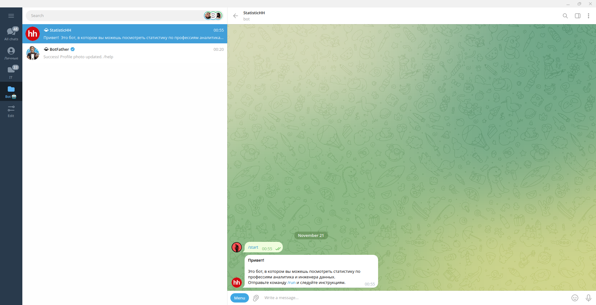
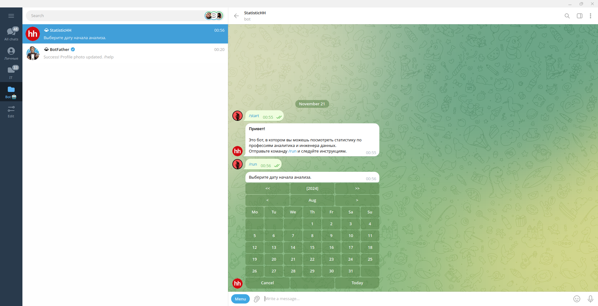
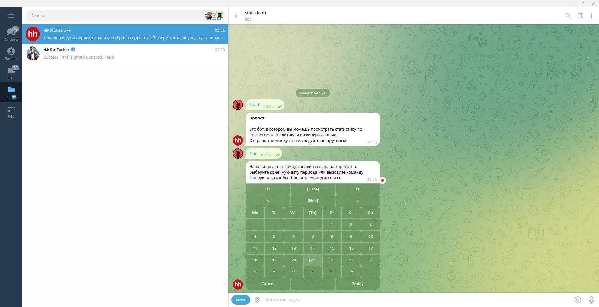
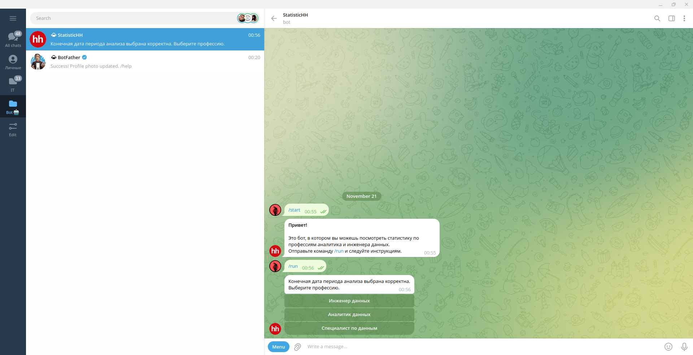
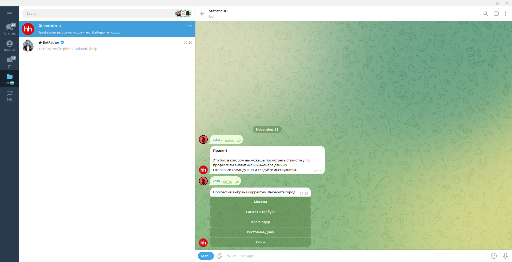
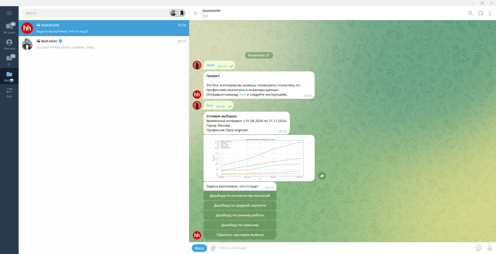

# StatisticHH
Данный проект создан с целью сбора статиски о вакансиях на сайте компании HeadHunter и предоставлении статистики о вакансиях.

## Содержание
- [Технологии](#технологии);
- [Разработка](#разработка);
- [Deploy](#deploy);

## Технологии
- [PostgresSQL](https://www.postgresql.org/);
- [FastAPI](https://fastapi.tiangolo.com/);
- [Uvicorn](https://www.uvicorn.org/).

## Разработка

### Сервисы

#### База данных
Схема базы данных вы можете посмотреть в файле /source/schema.drawio.
Слой сырых данных:
- таблица stg_vacancies хранит сырые данные о вакансиях с сайта HeadHunter;
- таблица stg_exchange_rates хранит сырые данные о курсах валют с сайта ЦБ РФ.

Детальный слой данных:
- таблица d_skill хранит данные о навыках необходимых для данной вакансии;
- таблица fct_skill_vacancy хранит связь между навыком и конкретной вакансией;
- таблица d_vacancies хранит данные о вакансии;
- таблица d_city хранит данные о городах;
- таблица d_query_profession хранит данные о профессиях;
- таблица fct_exchange_rates хранит данные о значении курса по отношению к рублю;
- таблица d_exchange_rates хранит данные о курсах;

Слой витрин данных:
- таблица dm_metrics хранит метрики;
- таблица dm_skills хранит навыки;

Проедуры:
- процедура increment_pipline необходима для загрузки данных из слоя сырых данных в детальный слой данных и слоя витрин данных за последние сутки.
- процедура full_pipline необходима для загрузки данных из слоя сырых данных в детальный слой данных и слоя витрин данных при создании сервисов.

#### Сервис API
Принимает следующие виды get запросов:
- /metrics - для получения данных из таблицы dm_metrics;
- /skills - для получения данных из таблицы dm_skills;
- /cities - для получения данных из таблицы d_city;
- /professions - для получения данных из таблицы d_query_profession.

Принимает следующие виды post запросов:
- /pipline - для запуска парсинга данных с [официального сайта ЦБ РФ](https://www.cbr-xml-daily.ru/) и [API HH](https://dev.hh.ru/) и добавления этих данных в сырой слой в базе данных.

#### Сервис Pipline
Необходим для запуска пайпланов раз в сутки с помощью crontab. Раз в сутки обращается к API и запускает pipline для парсинга и обработки данных.

#### Сервис телеграмм бота
Необходим для взаимодействия с телеграмм ботом.
Пример использования.










### Требования
Для установки и запуска проекта, необходим [Docker](https://www.docker.com/) и бот в телеграмме.

### Запуск Development сервера
Чтобы запустить сервисы
```sh
sudo docker compose up --build
```

## Deploy
- Клонируйте проект.
- Установите [Docker](https://docs.docker.com/engine/install/ubuntu/).
- Внесите изменение в файлах .env в корневой директории и директории сервиса с пайплайном (/pipline).
- Запустите сервисы командой выше.
